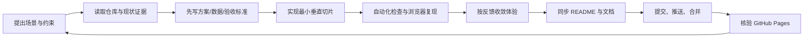

# AI 辅助开发复盘与可复用指引

> 案例：UNESCO 中国非遗数字博物馆（纯前端 H5 / GitHub Pages）
>
> 版本口径：本文以仓库当前 `main` 分支和 README 记录为准，当前已完成到 **v0.5.5**。版本号、功能状态和部署状态发生变化时，应同步更新本文或在版本记录中补充。

## 1. 这次项目是怎样从 0 到 1 推进的

这不是一次性生成“完整 App”，而是把一个很大的愿景拆成可验证的垂直切片：先有能部署的骨架，再有专题馆，再有一个可打磨的精品展厅，最后把音频、全景、内容来源和质量门禁补齐。

| 阶段 | 用户提出的核心问题 | 交付结果 | 关键经验 |
| --- | --- | --- | --- |
| v0.1–v0.2 | 先做什么、怎样放到 GitHub Pages | React/Vite 纯前端骨架、路由、README、Pages 工作流 | 先确定可运行、可发布的最小闭环 |
| v0.3 | 40 多个 UNESCO 项目如何组织 | 专题馆导航、精品展厅结构、UNESCO 清单与筛选搜索 | 以“戏曲馆、茶文化馆、节庆馆”等用户体验组织内容，不被行政分类绑住 |
| v0.4 | 先把京剧做成旗舰展厅 | 京剧详情、行当/功法/舞台/比较、全景入口 | 先做一个深度样板，再抽象通用模板 |
| v0.4.1–v0.4.2 | 360° 图片为何不是球面播放器、锚点为何空白 | Photo Sphere Viewer 球面播放器、4096×2048 概念全景、图文降级、Hash 路由修复 | 先解释技术概念，再用可复现的故障现象验收 |
| v0.4.3–v0.4.5 | 三分钟认识京剧、语音与文字如何同步 | AI 合成音频、逐句时间轴、完整稿高亮、点击文字跳转、保持原段落并仅改文字颜色 | 交互细节由用户连续反馈收敛，不能只验收“能播放” |
| v0.4.6 | GitHub Pages 部署出现 `/src/main.tsx` 404 | 修正 Pages 构建来源、Corepack/pnpm、Actions Node 24 警告处理 | 必须核对发布后的真实 URL 和静态资源，而不是只看构建绿灯 |
| v0.5.0 | 茶内容少、互动弱 | 茶文化馆、采茶→制茶→冲泡→茶礼流程、茶叶/茶器/地域内容、图片流 | “内容丰富”要翻译成数量、交互动作和来源要求 |
| v0.5.1–v0.5.3 | 精品展厅最低标准是否达标 | 通用展厅基础、来源/权利/AI 标识、京剧时间轴与社群视角、茶馆语音与社群视角 | 先读交付标准文档，再按缺口补齐，文档是验收基线 |
| v0.5.4–v0.5.5 | 音色、停顿、单句替换和进度是否专业 | CosyVoice 3 合成音频、逐句 M4A、完整进度拖动、图片 WebP 压缩与源文件分离 | 媒体功能既要体验闭环，也要可维护、可重生成、可审计 |

## 2. 高质量提问的基本结构

最有效的需求不是“帮我加一个功能”，而是把**背景、用户结果、范围、约束、验收、交付动作**一次说清楚。可以复制下面的模板：

```text
背景：当前版本/页面/已存在的实现是……
目标：用户完成什么任务后，应该看到或感受到什么……
范围：只修改哪些页面、数据、资源和脚本；明确不做什么……
约束：技术栈、设备、版权、无障碍、性能、AI 披露、目录和分支规则……
验收：列出可观察的通过条件（点击、播放、跳转、刷新、移动端、降级）……
证据：提供 URL、截图、控制台错误、复现步骤或参考文档……
交付：需要文档先行吗？需要测试、README、提交、推送或合并吗？
```

### 2.1 把模糊意见变成可开发要求

- “茶的内容不够丰富” → “增加 5 个地域茶样、5 类茶器、4 步工序交互、图片流、每项来源/权利/更新时间，并覆盖移动端触控”。
- “全景不对” → “初始视角面向化妆台，保留图文降级；说明 yaw 单位，调整相机距离/初始俯仰，并给出鼠标、触摸和陀螺仪验收步骤”。
- “同步文字稿不好用” → “完整文稿保持原段落；当前句只改文字颜色；点击任意句时，音频累计进度、章节标签、高亮句同时切换”。
- “部署报错” → “给出发布 URL、完整错误、期望入口和不应破坏的本地开发流程；修复后运行构建、E2E，并用发布 URL 二次核验”。

### 2.2 适合迭代的提问顺序

1. 先问方向：专题馆如何分组、先做哪一个精品展厅。
2. 再问标准：最低交付标准、数据来源、权利和 AI 披露。
3. 再问实现：组件、数据结构、播放器、资源尺寸、降级方案。
4. 最后问交付：测试、README、提交、推送、合并和远端复核。

## 3. AI 辅助开发的闭环工作法



每一轮只解决一个可描述的问题，并保留证据：

1. **现状**：先看目录、路由、数据 Schema、最近提交和未提交改动，避免覆盖用户工作。
2. **方案**：涉及新技术时先查官方文档；涉及内容时先确定来源、权利和更新时间。
3. **最小实现**：优先完成一条从数据到页面、从点击到反馈、从资源到降级的完整路径。
4. **验证**：格式、Lint、类型、单测、构建，再做涉及核心交互的 E2E；部署类问题必须测线上 URL。
5. **反馈收敛**：把“看起来不对”改写成初始状态、操作动作、实际结果、期望结果四项。
6. **交付**：更新 README/方案文档，检查 diff 只包含本轮范围，再提交和发布。

## 4. 本项目中的约束清单

### 产品与内容

- 用简体中文沟通和写文档；专题馆优先按文化体验组织。
- UNESCO 核心项目、国家级对照项目、知识节点必须明确区分。
- 事实字段提供来源、更新时间和权利信息；AI 生成图片、AI 合成语音必须显著披露。
- AI 概念素材不是历史档案，不冒充传承人、艺术家或真人录音。

### 工程与安全

- React 函数组件和 Hooks，TypeScript 严格模式，JS/TS 使用 ESM，禁止新增 class 组件。
- 内容边界使用 Schema 校验；前端不保存 API 密钥、私人联系方式或受限资料。
- 纯前端优先保持 GitHub Pages 可部署；需要模型或密钥时放在受控的本地/远端生成流程，仓库只提交成品和元数据。
- 媒体有清晰替代文本、字幕/文字稿、加载失败状态和图文降级；触控目标约 44px；尊重 `prefers-reduced-motion`。

### Git 与发布

- 每个里程碑使用 `codex/` 分支；`main` 是正式发布分支。
- 功能、目录、数据口径或版本状态变化时，同一次提交同步更新 README。
- 不提交 `node_modules/`、`dist/`、测试报告、本地环境文件、模型权重和未经授权的原始档案。

## 5. 用到的能力与 skill

| 能力/skill | 在本项目中的用途 | 可迁移做法 |
| --- | --- | --- |
| 仓库检索与终端 | 读取目录、`rg` 定位路由/数据、查看 diff 和提交 | 先建立“现状地图”，再编辑最小文件集 |
| GitHub skill / `gh` | 分支、Actions、Pages 来源、提交推送、合并和线上核验 | 将“代码交付”和“发布验证”视为两件事 |
| Web 官方资料检索 | UNESCO、Photo Sphere Viewer、MDN、GitHub Actions/Pages、CosyVoice 官方资料 | 技术问题优先一手文档，避免内容农场 |
| imagegen skill | 生成茶馆/京剧概念图、4096×2048 全景和展厅素材 | 明确尺寸、用途、AI 标识和降级资源 |
| 浏览器与 E2E | 验证 Hash 路由、全景、音频跳转、移动端布局和线上资源 | 用用户操作描述测试，而不是只看编译成功 |
| React/Vite/TypeScript | 页面、组件、数据驱动展厅和 GitHub Pages 构建 | 内容与 UI 分离，先做通用模板再扩展馆别 |
| Zod/Schema 校验 | 校验展厅、音频 cue、来源和媒体元数据 | 让错误在构建或测试阶段暴露 |
| CosyVoice 3 音频流水线 | 逐句生成、停顿、响度、M4A 转码、累计时间轴 | 单句资源可替换，manifest/JSON 是唯一时间轴来源 |
| 文档先行/产品审查 | `docs` 中维护里程碑、最低标准、音频和远端服务说明 | 先写“完成定义”，再写代码 |

## 6. 常用的可复制提问模板

### 新里程碑

```text
开始里程碑“vX.Y：……”。请先阅读 README、AGENTS.md、相关 docs 和现有实现。
先产出方案文档：目标、用户流程、数据结构、资源清单、版权/AI 披露、验收标准、风险和回滚点。
文档确认后再开发；实现后运行 format、lint、typecheck、test、build，涉及核心交互再跑 test:e2e。
提交前同步 README，提交范围只能包含本里程碑文件。
```

### 修复问题

```text
问题页面/URL：……
复现步骤：1…… 2…… 3……
实际结果：……（附控制台/网络错误）
期望结果：……
不能破坏：……
请先定位根因，再给出最小修复；修复后补回归测试并验证线上地址。
```

### 媒体或 AI 能力

```text
媒体用途：……
输入规格：尺寸、格式、比例、单个/整段、目标设备……
交互：播放、暂停、拖动、点击跳转、加载失败、无障碍……
来源与披露：来源 URL、授权、AI 生成/合成标识、更新时间……
性能要求：首屏体积、压缩格式、是否保留源文件……
请给出生成/转码脚本、元数据格式、前端降级和验收用例。
```

### 发布与合并

```text
请检查当前分支、工作区未提交改动和远端状态。
只提交本次范围；先通过质量门禁，再提交并推送。
发布后打开 GitHub Pages URL，核对入口、JS/CSS、图片、音频和 Hash 路由。
确认无误后再合并到 main，并报告提交号、线上地址和仍待办事项。
```

## 7. 质量门禁与完成定义

提交前按项目约定执行：

```bash
pnpm format:check
pnpm lint
pnpm typecheck
pnpm test
pnpm build
pnpm test:e2e
```

一个里程碑只有同时满足以下条件，才应称为“完成”：

- 需求中的主路径可操作，刷新和直接打开深链接不空白；
- 数据、来源、权利、更新时间和 AI 标识齐全；
- 关键媒体有失败/无设备/低带宽降级；
- 自动化质量门禁通过，核心交互有回归用例；
- README、方案文档和版本记录同步；
- 发布后的 GitHub Pages 真实页面已复核，而非只看 CI 状态。

## 8. 反模式与改进方式

| 反模式 | 后果 | 改进 |
| --- | --- | --- |
| 只说“做得更丰富、更好看” | 无法验收，反复返工 | 指定内容数量、交互动作、来源和通过条件 |
| 直接写代码，不先看仓库 | 覆盖现有改动、重复造组件 | 先读 AGENTS、README、目录、diff 和最近提交 |
| 只验证本地构建 | Pages 仍可能 404 或资源路径错误 | 构建 + E2E + 线上 URL 网络检查 |
| 把全景展开图当成 360 播放器 | 体验和预期不一致 | 明确 equirectangular 素材、球面播放器、初始视角和图文降级 |
| 用一句段落替换完整文字稿 | 用户无法定位上下文 | 保留原段落，按句计算高亮和累计进度 |
| 把 AI 素材当历史资料 | 产生事实和版权误导 | 标注“AI 概念素材/AI 合成语音”，事实仍以来源为准 |
| 把密钥放进前端 | GitHub Pages 泄露密钥 | 生成在受控环境，前端只消费静态成品 |

## 9. 一句话方法论

**用用户场景提出问题，用官方资料和仓库证据约束答案，用文档定义完成，用最小垂直切片实现，用自动化和线上复核证明，再用反馈迭代体验。**

这套方法不依赖某个模型或某个前端框架；换成其他非遗主题、内容平台或静态站点，仍可按同样的节奏复用。
