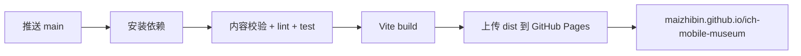

# UNESCO 中国非遗数字博物馆：纯前端迭代路线

> 目标：先以纯前端静态站在 GitHub Pages 持续展示，再平滑演进到小程序、App 和后端服务。  
> 展示地址：<https://maizhibin.github.io/ich-mobile-museum/>  
> 产品范围：专题馆 + 45 个 UNESCO 中国非遗精品展厅。

## 1. 技术决策

### 1.1 第一阶段保持纯前端

纯前端足以支持：

- 专题馆、展厅、项目清单和静态搜索。
- 图片、音频、视频、360° 序列图和轻量 3D。
- 内容比较、时间轴、工序动画、小游戏。
- 本地收藏、足迹、播放进度和长辈模式。
- GitHub Pages 自动部署和版本预览。

暂不支持或只做演示：

- 真正的生成式 AI 问答与语音合成。
- 跨设备账户同步。
- CMS 在线编辑和多人审核。
- 需要隐藏密钥的第三方 API。
- 服务端语义搜索、推荐和复杂统计。

前端中不放任何 AI API Key。纯前端阶段的“AI 讲解”采用预生成、人工审核的内容或交互演示；接入实时 AI 时再建立服务端代理。

### 1.2 推荐前端栈

- Vite + React + TypeScript。
- 函数组件与 Hooks，不使用 class 组件。
- React Router；GitHub Pages 阶段使用 `HashRouter` 保证深链接刷新可靠。
- CSS Variables + CSS Modules；先不引入重量级 UI 框架，保留当前视觉特征。
- Zod 在构建期校验展厅 JSON 数据。
- Fuse.js 做 45 项规模的客户端搜索。
- Vitest + Testing Library 做逻辑和组件测试。
- Playwright 做核心参观流程和移动端视口验证。
- ESLint + Prettier 做自动检查。

不建议第一版引入 Next.js、SSR、数据库客户端或微前端。GitHub Pages 是静态托管，Vite SPA 更直接；45 个项目的数据量也不需要复杂服务端框架。

### 1.3 数据方式

所有展厅数据以版本化 JSON 保存，通过 TypeScript Schema 校验：

```text
content/
├── unesco-elements.json
├── museums/
│   ├── opera.json
│   ├── tea.json
│   └── festivals.json
├── exhibitions/
│   ├── peking-opera.json
│   ├── traditional-tea.json
│   └── taijiquan.json
└── sources.json
```

页面不直接依赖硬编码对象。未来后端 API 只需返回同一 Schema，UI 无需整体重写。

## 2. 目录调整建议

### 2.1 现在推荐的目录

```text
ich-mobile-museum/
├── .github/
│   └── workflows/
│       └── deploy-pages.yml
├── content/                    # 可版本化的展厅与名录数据
│   ├── exhibitions/
│   ├── museums/
│   ├── sources.json
│   └── unesco-elements.json
├── docs/                       # 产品、数据和技术设计文档
├── public/                     # 不经打包处理的静态资源
│   ├── audio/
│   ├── images/
│   ├── models/
│   └── videos/
├── scripts/                    # 内容校验、资源优化、数据生成脚本
├── src/
│   ├── app/                    # 路由、Provider、全局布局
│   ├── components/             # 通用 UI 组件
│   ├── features/               # 按产品能力组织
│   │   ├── exhibitions/
│   │   ├── museums/
│   │   ├── compare/
│   │   ├── search/
│   │   ├── player/
│   │   └── profile/
│   ├── content/                # Schema、加载器、查询函数
│   ├── routes/                 # 页面级组件
│   ├── styles/                 # 设计令牌、全局样式、无障碍模式
│   ├── types/
│   └── main.tsx
├── tests/
│   └── e2e/
├── index.html
├── package.json
├── tsconfig.json
└── vite.config.ts
```

### 2.2 现在不要建立 `frontend/` 与 `backend/`

当前仓库只有一个实际应用。把所有代码移进 `frontend/`，同时放一个空 `backend/`，只会增加脚本路径、部署配置和理解成本。

推荐演进条件：

- 只有 Web：保持根目录单应用结构。
- 开始开发小程序：升级为 `apps/web`、`apps/miniprogram`、`packages/content-schema`。
- 开始开发服务端：再增加 `apps/api`，不要使用泛化的 `backend` 名称。
- 多端共享内容：将 Schema、内容和 API Client 放入 `packages/`。

未来目录形态：

```text
apps/
├── web/
├── miniprogram/
├── mobile/
└── api/
packages/
├── content-schema/
├── museum-content/
├── api-client/
└── design-tokens/
```

这个迁移点应放在小程序或 API 正式立项时，而不是现在。

## 3. GitHub Pages 设计

### 3.1 部署方式

使用 GitHub Actions 构建 `dist/` 并部署到 Pages，不提交构建产物：



关键配置：

- Vite `base` 为 `/ich-mobile-museum/`。
- 路由先使用 Hash 模式，如 `/#/museum/opera`，避免 GitHub Pages 刷新 404。
- 图片和音频通过 `import.meta.env.BASE_URL` 或模块导入生成正确路径。
- Actions 只部署 `main`；Pull Request 运行检查但不覆盖正式站。
- 开启 Actions 缓存并固定 Node.js LTS 版本。
- `dist/`、`node_modules/` 保持在 `.gitignore`。

### 3.2 资源约束

- 首屏图片优先 AVIF / WebP，并保留 JPEG 降级。
- 音频使用 AAC / MP3，按章节加载，不把完整音频打进 JS。
- 3D 模型使用 glTF / GLB + Draco / Meshopt，提供海报图和视频降级。
- 每个专题馆资源按路由懒加载。
- 建议移动网络首屏初始传输不超过约 1.5 MB，非必要媒体点击后加载。
- 大体积原始馆藏不要直接放 Git 仓库；GitHub Pages 只放经授权的分发版本。

## 4. 版本规划

### v0.2：工程化与 Pages 上线

目标：把当前单文件原型迁移为可持续开发、可自动部署的 TypeScript 前端。

任务：

- 建立 Vite + React + TypeScript 工程。
- 将当前页面拆为路由、组件、功能模块。
- 保留现有视觉和京剧互动，不进行大规模重设计。
- 建立设计令牌：颜色、字体、间距、圆角、阴影、动效。
- 将项目数据从 `app.js` 移至 JSON 内容层。
- 建立 Zod Schema 和内容校验脚本。
- 配置 ESLint、Prettier、Vitest。
- 新增 GitHub Pages Actions 自动部署。
- 补充 README：本地开发、构建、内容编辑、部署说明。

验收：

- GitHub Pages 地址可以稳定访问。
- 直接打开首页和 Hash 路由均正常。
- 首页、地图、互动、我的、京剧详情功能不回退。
- `lint`、`typecheck`、`test`、`build` 全部通过。
- 手机 375 px、390 px、430 px 和桌面视口无横向溢出。

### v0.3：专题馆骨架与 45 项名录

目标：从“几个演示项目”升级为 UNESCO 精品馆群的真实产品框架。

任务：

- 一级导航调整为首页、专题馆、发现、互动、我的。
- 建立 9 个专题馆数据和页面模板。
- 导入并审核 45 项 UNESCO 基础数据。
- 增加 40 / 3 / 2 名录类型解释。
- 建立核心展厅、国家级对照展项、知识节点三种身份样式。
- 上线专题馆筛选、客户端搜索、年份时间线和项目详情基础版。
- 建立官方来源弹层和“数据更新于”信息。

验收：

- 45 项均可通过名称、年份、名录类型和专题馆找到。
- 任一项目详情都能回溯 UNESCO 官方来源。
- 非 UNESCO 对照项目不会显示 UNESCO 身份。
- 新用户能在 3 次点击内进入一个精品展厅。

### v0.4：京剧旗舰展厅

目标：将当前京剧专题做成第一个完整的精品展厅，确定后续展厅制作标准。

任务：

- 完整迁移三分钟导览、行当、脸谱、唱做念打、舞台和剧目模块。
- 建立带章节、字幕、全文稿和倍速的音频播放器。
- 增加京剧、昆曲、粤剧、越剧的第一版比较台。
- 比较妆容、唱腔、乐器、行当和舞台。
- 全景模块加入资源加载状态、键盘操作和非全景降级。
- 真人音频与 AI 演示使用不同标签和说明。
- 收藏、足迹和展厅完成度统一到本地数据层。

验收：

- 京剧展厅核心路径可在 8—12 分钟内完整参观。
- 音频具备字幕 / 文字稿，所有图片具备替代文本。
- 比较台最多选择 3 个剧种，缺失资料有明确说明。
- 全景不可用时仍能完成参观。

### v0.5：茶文化馆与流程引擎

目标：验证跨地区项目、工序流程和器物浏览。

任务：

- 上线中国传统制茶技艺及相关习俗精品展厅。
- 制作采茶 → 制茶 → 泡茶 → 茶礼 → 茶器交互流程。
- 加入龙井、武夷岩茶、普洱茶、铁观音、白茶比较路径。
- 建立可复用的步骤流、材料卡、工序对比和 360° 器物组件。
- 加入地方子项地图，但地图作为展厅内容而非一级分类。

验收：

- 用户能清楚区分 UNESCO 总项目与地方茶实践。
- 流程组件可仅替换 JSON 数据复用于其他手工艺。
- 低性能设备可关闭动画，完整文字内容仍可访问。

完成状态：已于 v0.5.0 交付，并于 v0.5.6 加入山间茶室 360° 球面全景、空间讲解点、陀螺仪与图文降级。详细设计、内容口径与验收记录见 [v0.5 茶文化馆与通用工序流程](./v0.5-tea-culture-process-flow.md)。

### v0.6：太极拳与动作播放器

目标：验证身体实践类项目的数字展示。

任务：

- 多视角视频、0.25×—1× 慢放、章节循环。
- 动作轨迹和重心示意叠加。
- 太极拳与少林功夫、八卦掌、咏春的基础比较。
- 跟练镜像模式；一期不做人脸或身份识别。
- 添加安全提示和动作能力降级。

验收：

- 视频切换和慢放在移动端稳定。
- 摄像头默认关闭，启用时数据仅在本地处理。
- 产品不提供医疗、康复或专业动作诊断。

### v0.7：剪纸、手工艺通用组件

目标：验证纹理、工序、3D 和 AI 讲解占位协议。

任务：

- 剪纸纹理超级放大镜。
- 折叠、画样、剪刻、展开的工序动画。
- 360° 作品转台与热点标注。
- 建立手工艺通用组件，供云锦、黎锦、青瓷、宣纸、木拱桥使用。
- AI 讲解先读取预生成问答数据，并保留未来 API 接口契约。

验收：

- 放大交互支持触控、滚轮和键盘。
- 互动关闭后仍有等价图文工序。
- “AI 讲解演示”不会误导为实时生成服务。

### v0.8：春节、节庆馆与运营机制

目标：验证节令时间轴、地方差异和周期性内容运营。

任务：

- 春节精品展厅、年历和地方习俗地图。
- 接入端午、二十四节气、羌年。
- 清明、中秋作为明确标级的对照主题。
- 亲子任务、习俗排序和 AR 龙舟演示。
- 建立按日期自动切换首页专题的静态运营配置。

验收：

- 公历、农历、节气概念不混用。
- 一种地方习俗不会被描述为全国统一习俗。
- AR 不可用时自动提供 3D 或视频降级。

### v0.9：补齐 45 个基础展厅

目标：所有 UNESCO 中国项目至少具备可信、可参观、可检索的基础展厅。

基础展厅标准：

- UNESCO 类型、年份、官方编号和来源。
- 3—5 分钟导览或等价图文。
- 1 个核心结构图、时间轴或地图。
- 8 件以上合规数字资产；素材不足时宁缺毋滥。
- 人与社区、保护进行时、关联项目。
- 至少一种无障碍内容形式。

验收：45 项数据覆盖率 100%，关键事实来源覆盖率 100%，媒体权利状态覆盖率 100%。

### v1.0：精品馆群正式版

目标：从展示原型升级为可公开推广的正式产品。

任务：

- 五个旗舰专题馆达到完整体验标准。
- 全站性能、无障碍、SEO、版权和内容审核。
- 离线缓存常用文本、缩略图和最近展厅。
- 数据版本、更新日志和纠错反馈渠道。
- GitHub Release、版本说明和可恢复部署。
- 根据真实使用数据决定后端、小程序和 App 的优先级。

## 5. 每版开发节奏

每个版本采用同一流程：

1. 内容与交互范围冻结。
2. JSON 数据和来源先通过校验。
3. 实现组件与页面。
4. 移动端、键盘、读屏、低性能降级验证。
5. `format → lint → typecheck → test → build → e2e`。
6. Pull Request 预览与内容复核。
7. 合并 `main` 后自动部署 GitHub Pages。
8. 发布版本说明并记录数据版本。

建议前几个版本保持 2—3 周一个小版本；内容素材准备可与开发并行，但没有版权或来源的内容不能进入正式构建。

## 6. 何时引入后端

满足以下任一条件再启动 `apps/api`：

- 需要实时 AI 问答、语音合成或语义搜索。
- 需要登录、跨设备同步或用户数据导出 / 删除。
- 需要编辑后台、多人审核或不发版更新内容。
- 媒体需要签名地址、付费授权或地区限制。
- 45 项静态内容导致构建和更新流程不可维护。

后端引入后，前端内容加载器从本地 JSON 切换到 API，但继续复用同一 Zod Schema；GitHub Pages 可以继续作为纯静态展示站，也可以迁移到支持服务端能力的托管平台。

## 7. 近期建议任务

下一步优先做 v0.2，而不是继续往当前 `app.js` 追加展厅：

- 将现有原型迁移到 Vite + React + TypeScript。
- 建立新目录和内容 Schema。
- 配置 GitHub Pages 自动部署。
- 保持当前 UI 可用并完成回归验证。

完成 v0.2 后再进入专题馆视觉和信息架构调整，能显著降低后续 45 个展厅的重复开发成本。
