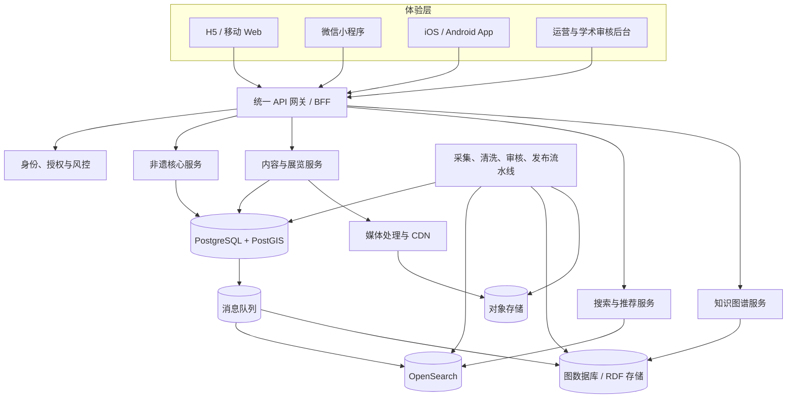
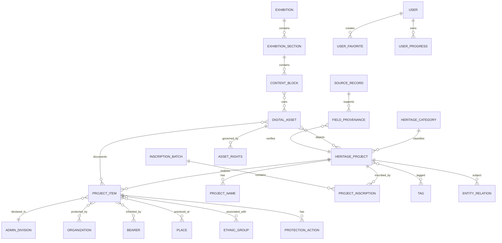
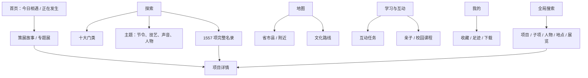

# 全国国家级非遗数据库与数字博物馆产品方案

> 版本：v1.0（2026-07-13）  
> 适用端：H5、微信小程序、iOS / Android App、运营管理后台  
> 核心口径：1557 个国家级代表性项目，按申报地区或单位拆分为 3610 个子项。

> 实施范围更新：第一阶段已调整为 UNESCO 中国非遗精品馆群。具体范围、专题馆结构和制作顺序见 [UNESCO 中国非遗精品馆群 MVP 方案](./unesco-china-boutique-museums-mvp.md)。本文件继续作为全国 1557 项扩展阶段的数据与平台蓝图。

## 1. 结论与边界

这套系统不应建成一张“1557 行的大表”，而应采用四层结构：

1. **名录层**：1557 个项目，使用国家项目编号作为业务唯一标识，如 `Ⅱ-28`。
2. **保护层**：3610 个子项，表达同一项目在不同地区、社区、申报单位下的具体形态和保护责任。
3. **知识层**：人物、机构、地点、民族、技艺、器物、作品、节庆、事件等可复用实体及关系。
4. **内容层**：文章、图片、音视频、全景、3D、互动展览、课程等数字馆藏。

官方当前公开口径为：国务院于 2006、2008、2011、2014、2021 年公布五批国家级名录，共 1557 个国家级项目；按申报地区或单位逐一统计，共 3610 个子项。扩展项目与原项目共用项目编号，但地区形态、传承状况和保护单位可以不同。因此，`heritage_project` 与 `project_item` 必须拆表。

### 1.1 建设目标

- 数据目标：完整、可追溯、可版本化地管理 1557 项 / 3610 子项及后续变更。
- 公众目标：让用户能按地图、门类、人物、主题和故事理解非遗，而非只浏览名录。
- 保护目标：记录保护单位、传承人、数字资源、田野调查与保护行动。
- 平台目标：一套内容与服务底座，适配 H5、小程序、App 和运营后台。
- 开放目标：对公众提供稳定查询 API，对合作机构提供受控数据交换能力。

### 1.2 非目标

- 不把百科式文本堆砌当作数字博物馆。
- 不将“国家级项目”“地方级项目”“联合国教科文组织名录”混为一个等级字段。
- 不用 AI 生成内容替代官方事实；AI 只可辅助标注、检索、推荐和草稿生产。
- 不公开传承人的敏感联系方式、精确住址或受限仪式资料。

## 2. 统一术语与编码

| 术语 | 含义 | 示例 |
|---|---|---|
| 国家级项目 | 共用国家项目编号的名录项目 | 京剧，`Ⅳ-28` |
| 子项 | 某项目在具体申报地区或单位的保护实例 | 某地的同名项目分支 |
| 新增项目 | 首次进入某批国家级名录 | `NEW` |
| 扩展项目 | 对已有编号新增地区或单位实例 | `EXTENSION` |
| 保护单位 | 对具体子项承担保护责任的机构 | 文化馆、研究院等 |
| 代表性传承人 | 经认定的代表性传承人 | 与一个或多个子项关联 |
| 数字资源 | 图片、音频、视频、文档、3D、全景等 | 一段唱腔录音 |
| 展览 | 面向公众编排的主题内容 | “三分钟认识京剧” |

内部主键统一使用 UUIDv7；外部公开 ID 使用不可枚举的短 ID。官方编号同时保存原文和规范化值：

```text
official_code_raw: Ⅱ-28
official_code_normalized: II-028
category_code: II
sequence_no: 28
```

不得把项目名称当唯一键；同名、括号别名、行政区划变更都会导致误合并。

## 3. 总体技术架构



### 3.1 推荐技术选型

- 权威业务库：PostgreSQL 16+；行政区划和地图使用 PostGIS。
- 全文检索：OpenSearch，支持中文分词、拼音、同义词、聚合筛选和地理搜索。
- 图谱：一期可用 PostgreSQL 关系表投影；关系规模和图算法需求明确后再引入 Neo4j 或 RDF 三元组库。
- 文件：兼容 S3 的对象存储 + CDN；原件与分发件分桶、分权限保存。
- 缓存：Redis，用于热点项目、会话、限流和短期推荐结果，不作事实源。
- 异步：消息队列驱动索引更新、转码、缩略图、图谱投影与审计。
- API：REST 为主，后台复杂聚合可补充 GraphQL；开放数据使用 JSON-LD。

原则是“PostgreSQL 为唯一事实源，搜索和图数据库均可重建”。

## 4. 核心 ER 图



## 5. 数据库设计

所有表默认包含：

| 字段 | 类型 | 说明 |
|---|---|---|
| `id` | `uuid` | UUIDv7 主键 |
| `created_at` / `updated_at` | `timestamptz` | 创建、更新时间 |
| `created_by` / `updated_by` | `uuid null` | 操作人 |
| `version` | `int` | 乐观锁版本 |
| `deleted_at` | `timestamptz null` | 逻辑删除，仅内部使用 |

### 5.1 名录域

#### `heritage_category` 十大门类

| 字段 | 类型 | 约束 / 说明 |
|---|---|---|
| `code` | `varchar(8)` | 唯一；`I`—`X` |
| `name_zh` | `varchar(64)` | 现行名称 |
| `former_name_zh` | `varchar(64) null` | 2008 年前名称 |
| `sort_order` | `smallint` | 1—10 |
| `description` | `text null` | 门类说明 |

固定值：民间文学、传统音乐、传统舞蹈、传统戏剧、曲艺、传统体育游艺与杂技、传统美术、传统技艺、传统医药、民俗。

#### `heritage_project` 国家级项目（目标 1557 条）

| 字段 | 类型 | 约束 / 说明 |
|---|---|---|
| `public_id` | `varchar(24)` | 唯一，对外暴露 |
| `official_serial_no` | `int` | 官方项目序号，唯一 |
| `official_code_raw` | `varchar(32)` | 官方显示编号，如 `Ⅱ-28` |
| `official_code_normalized` | `varchar(32)` | 唯一，如 `II-028` |
| `category_id` | `uuid` | FK → `heritage_category` |
| `sequence_no` | `int` | 门类内序号 |
| `canonical_name` | `varchar(255)` | 规范名称，不含地域子项后缀 |
| `slug` | `varchar(255)` | 唯一，稳定 URL |
| `summary` | `text null` | 80—150 字公众摘要 |
| `history` | `text null` | 历史沿革，需来源 |
| `cultural_value` | `text null` | 历史、文学、艺术、科学价值 |
| `practice_form` | `text null` | 实践形态 |
| `transmission_status` | `varchar(32)` | `THRIVING/STABLE/AT_RISK/CRITICAL/UNKNOWN` |
| `visibility` | `varchar(16)` | `PUBLIC/RESTRICTED/PRIVATE` |
| `publication_status` | `varchar(16)` | `DRAFT/REVIEW/PUBLISHED/ARCHIVED` |
| `content_quality_score` | `numeric(5,2)` | 完整度评分，不代表文化价值 |
| `published_at` | `timestamptz null` | 首次上架时间 |

索引：`official_code_normalized` 唯一索引；`category_id, sequence_no`；`publication_status, published_at`；名称使用全文与 trigram 索引。

#### `project_name` 名称、别名与多语种

| 字段 | 类型 | 说明 |
|---|---|---|
| `project_id` | `uuid` | FK |
| `language` | `varchar(16)` | BCP 47，如 `zh-CN`、`en` |
| `name` | `varchar(255)` | 名称 |
| `name_type` | `varchar(24)` | `OFFICIAL/ALIAS/HISTORICAL/LOCAL/TRANSLATION` |
| `is_preferred` | `boolean` | 该语言首选名称 |
| `source_record_id` | `uuid null` | 来源 |

唯一约束：`project_id, language, name, name_type`。

#### `inscription_batch` 公布批次

| 字段 | 类型 | 说明 |
|---|---|---|
| `batch_no` | `smallint` | 1—5，唯一 |
| `name` | `varchar(128)` | 第一批等 |
| `announcement_date` | `date` | 公布日期 |
| `document_no` | `varchar(64)` | 国务院文号 |
| `source_url` | `text` | 官方文件 |

#### `project_inscription` 项目入选记录

| 字段 | 类型 | 说明 |
|---|---|---|
| `project_id` | `uuid` | FK |
| `batch_id` | `uuid` | FK |
| `inscription_type` | `varchar(16)` | `NEW/EXTENSION` |
| `announcement_name_raw` | `varchar(255)` | 公布时原名 |
| `announcement_serial_no` | `int null` | 公布表中的序号 |
| `notes` | `text null` | 勘误或说明 |

#### `project_item` 地区 / 单位子项（目标 3610 条）

| 字段 | 类型 | 约束 / 说明 |
|---|---|---|
| `public_id` | `varchar(24)` | 唯一 |
| `project_id` | `uuid` | FK，所属国家级项目 |
| `inscription_id` | `uuid` | FK，本子项进入名录的记录 |
| `item_name` | `varchar(255)` | 官方子项名，可含括号地域名 |
| `item_name_normalized` | `varchar(255)` | 检索与去重用 |
| `declaration_region_id` | `uuid null` | FK → 行政区划 |
| `declaration_unit_text` | `varchar(255)` | 官方“申报地区或单位”原文，必须保留 |
| `declaration_org_id` | `uuid null` | 申报主体为机构时使用 |
| `protection_unit_text` | `varchar(500) null` | 官方保护单位原文 |
| `local_characteristics` | `text null` | 地方形态差异 |
| `status` | `varchar(24)` | `ACTIVE/RENAMED/MERGED/REVOKED/UNKNOWN` |
| `valid_from` / `valid_to` | `date null` | 历史有效期 |
| `centroid` | `geography(Point,4326) null` | 展示用中心点，不等于精确实践地点 |
| `visibility` | `varchar(16)` | 公开级别 |

去重候选键不能只依赖名称，建议唯一约束为 `project_id, inscription_id, declaration_unit_text, item_name_normalized`，人工审核例外。

#### `project_item_organization`

| 字段 | 类型 | 说明 |
|---|---|---|
| `project_item_id` | `uuid` | FK |
| `organization_id` | `uuid` | FK |
| `role` | `varchar(24)` | `PROTECTION/DECLARATION/RESEARCH/PARTNER` |
| `valid_from` / `valid_to` | `date null` | 机构变更历史 |
| `is_current` | `boolean` | 当前责任单位 |
| `source_record_id` | `uuid` | 依据来源 |

### 5.2 地理与主体域

#### `admin_division`

保存国家统计用区划代码、名称、层级、上级、有效期和边界几何。行政区划会变更，因此不得覆盖旧记录。

| 字段 | 类型 | 说明 |
|---|---|---|
| `gb_code` | `varchar(12)` | 统计用区划代码 |
| `name` / `full_name` | `varchar(128/255)` | 名称 |
| `level` | `varchar(16)` | `COUNTRY/PROVINCE/PREFECTURE/COUNTY/TOWNSHIP` |
| `parent_id` | `uuid null` | 自关联 |
| `valid_from` / `valid_to` | `date null` | 历史有效期 |
| `geometry` | `geometry(MultiPolygon,4326) null` | 边界 |

#### `place`

表达村落、社区、场馆、实践场所和文化空间，不与行政区划混用。

字段：`name`、`place_type`、`admin_division_id`、`address_text`、`location`、`geometry`、`precision_level`、`is_sensitive`、`description`。

#### `organization`

字段：`name`、`former_name`、`unified_social_credit_code`（受控）、`organization_type`、`admin_division_id`、`address_text`、`website`、`contact_public`、`status`、`valid_from/to`。

#### `bearer` 代表性传承人

| 字段 | 类型 | 说明 |
|---|---|---|
| `name` | `varchar(128)` | 公开姓名 |
| `gender` | `varchar(16) null` | 可空，避免强制推断 |
| `ethnic_group_id` | `uuid null` | FK |
| `birth_year` / `death_year` | `smallint null` | 公众端优先展示年份 |
| `recognition_level` | `varchar(24)` | `NATIONAL/PROVINCIAL/...` |
| `recognition_batch` | `smallint null` | 认定批次 |
| `biography` | `text null` | 已审核简介 |
| `portrait_asset_id` | `uuid null` | 肖像 |
| `privacy_level` | `varchar(16)` | `PUBLIC/LIMITED/PRIVATE` |
| `life_status` | `varchar(16)` | `LIVING/DECEASED/UNKNOWN` |

`bearer_project_item` 字段：`bearer_id`、`project_item_id`、`role`、`recognized_at`、`valid_from/to`、`source_record_id`。私人联系方式单独加密存储，不进入公众库或图谱。

#### `ethnic_group`

字段：`code`、`name_zh`、`name_en`、`description`。项目与民族是多对多关系，不允许根据地名自动推断。

### 5.3 保护与研究域

#### `protection_action`

字段：`project_item_id`、`action_type`（调查、记录、培训、展演、修复、生产性保护等）、`title`、`description`、`start_date`、`end_date`、`organization_id`、`funding_source`、`outcome`、`visibility`。

#### `fieldwork_record`

字段：`project_item_id`、`title`、`researcher_org_id`、`fieldwork_date`、`place_id`、`method`、`consent_record_id`、`access_level`、`summary`、`archive_no`。

#### `source_record` 来源与证据

| 字段 | 类型 | 说明 |
|---|---|---|
| `source_type` | `varchar(24)` | `OFFICIAL_DOC/WEBSITE/BOOK/PAPER/INTERVIEW/ARCHIVE` |
| `title` | `text` | 来源标题 |
| `publisher` | `varchar(255) null` | 发布者 |
| `document_no` | `varchar(128) null` | 文号 / 档号 |
| `url` | `text null` | 来源链接 |
| `published_at` | `date null` | 发布日期 |
| `retrieved_at` | `timestamptz null` | 获取时间 |
| `checksum` | `varchar(128) null` | 原始文件校验值 |
| `license` | `varchar(128) null` | 使用条件 |
| `snapshot_asset_id` | `uuid null` | 网页 / 文件快照 |
| `authority_rank` | `smallint` | 1 最高；官方文件优先 |

#### `field_provenance` 字段级溯源

字段：`entity_type`、`entity_id`、`field_name`、`source_record_id`、`source_locator`（页码、表格行等）、`extracted_value`、`confidence`、`verified_by`、`verified_at`。

任何项目编号、名称、批次、地区、保护单位的发布都必须至少有一条字段级来源。

### 5.4 数字资产与权利域

#### `digital_asset`

| 字段 | 类型 | 说明 |
|---|---|---|
| `asset_type` | `varchar(24)` | `IMAGE/AUDIO/VIDEO/DOCUMENT/PANORAMA/MODEL3D/TRANSCRIPT` |
| `title` / `description` | `text` | 标题、说明 |
| `storage_key_original` | `text` | 原件位置，仅服务端可见 |
| `mime_type` | `varchar(128)` | MIME |
| `size_bytes` | `bigint` | 大小 |
| `sha256` | `char(64)` | 去重与完整性 |
| `duration_ms` | `bigint null` | 音视频时长 |
| `width` / `height` | `int null` | 图像 / 视频尺寸 |
| `captured_at` | `timestamptz null` | 拍摄 / 录制时间 |
| `creator_text` | `varchar(255) null` | 创作者署名 |
| `language` | `varchar(16) null` | 语言 |
| `access_level` | `varchar(16)` | `PUBLIC/LOGIN/RESTRICTED/ARCHIVE` |
| `moderation_status` | `varchar(16)` | 审核状态 |
| `metadata` | `jsonb` | 类型特有元数据，不承载核心关系 |

关联表 `asset_entity_link`：`asset_id`、`entity_type`、`entity_id`、`relation_type`、`caption`、`sort_order`、`is_cover`。

#### `asset_rights`

字段：`asset_id`、`rights_holder`、`license_type`、`license_url`、`authorized_uses`、`territory`、`valid_from/to`、`attribution_text`、`download_allowed`、`derivative_allowed`、`commercial_allowed`、`consent_record_id`。

#### `consent_record`

保存拍摄、采访、肖像、公开传播和 AI 使用授权；字段包括授权主体、范围、渠道、期限、撤回状态和授权文件。授权文件属于受限资产。

### 5.5 内容编排域

#### `exhibition`

字段：`slug`、`title`、`subtitle`、`summary`、`cover_asset_id`、`audience`、`estimated_minutes`、`language`、`publication_status`、`published_at`、`curator_id`、`seo_metadata`。

#### `exhibition_section`

字段：`exhibition_id`、`title`、`anchor`、`sort_order`、`layout_type`、`learning_objective`。

#### `content_block`

字段：`section_id`、`block_type`、`sort_order`、`payload jsonb`、`fallback_text`、`accessibility_label`。`block_type` 可为文本、引文、图集、音频、视频、时间轴、地图、全景、3D、测验、人物卡、关系图。

内容块允许灵活 JSON，但项目、人物、地点、资产必须通过关联表引用，禁止把实体完整复制进 JSON。

### 5.6 用户与运营域

- `user`：匿名设备用户、微信用户、App 用户统一账户；开放平台身份与业务身份分离。
- `user_identity`：`provider`、`provider_subject`、`user_id`，微信 `openid` 按小程序 / 公众号隔离，跨应用使用 `unionid` 时需合法授权。
- `user_favorite`：`user_id`、`entity_type`、`entity_id`、`created_at`。
- `user_progress`：展览 / 音频 / 课程进度、最后位置、完成状态。
- `user_history`：默认短期保存并提供清除；个性化推荐需单独同意。
- `user_badge`：勋章和任务记录。
- `search_log`、`content_event`：使用匿名化 ID，避免采集不必要的个人数据。
- `editorial_task`、`review_comment`、`publication_revision`：编辑、专家、法务 / 权利三段式审核。
- `audit_log`：不可变操作审计，记录操作者、对象、前后摘要、时间和请求 ID。

## 6. 数据治理与导入流程


### 6.1 首批导入步骤

1. 冻结五批国务院 / 文旅部官方文件快照，记录 URL、发布日期、文号和 SHA-256。
2. 抽取项目序号、编号、公布名称、门类、批次、类型、申报地区或单位。
3. 以规范化官方编号聚合为 1557 个项目，以公布行和申报主体形成 3610 个子项。
4. 对括号子项名、合并单元格、多地区单元格、扩展项目执行专项解析规则。
5. 补录保护单位时记录“观察时间”，不覆盖历史保护单位。
6. 与官方页面总数、十大门类分布、五批新增 / 扩展数量做对账。
7. 失败记录进入人工队列，不静默丢弃。

### 6.2 质量规则

- `heritage_project` 发布数量应为 1557，`project_item` 目标数量应为 3610；差异必须有书面解释。
- 每个项目必须有且仅有一个规范化官方编号和一个门类。
- 每个子项必须关联项目、批次、申报原文和至少一条官方来源。
- 扩展子项必须关联既有项目编号，不得误建新项目。
- 经纬度必须带精度等级；敏感地点只展示行政区中心或模糊网格。
- 所有公开资产必须通过版权、肖像、隐私和文化敏感性审核。
- 项目事实更新使用新修订版，不直接覆盖已发布快照。

### 6.3 发布与版本

使用 `publication_revision` 保存实体快照：`entity_type`、`entity_id`、`revision_no`、`snapshot jsonb`、`change_summary`、`reviewed_by`、`published_at`。公众 API 响应包含 `data_version`、`updated_at`、`sources`；支持按版本生成差异报告和回滚。

## 7. API 设计

基础路径：`/api/v1`；UTF-8 JSON；时间使用 ISO 8601；分页优先 cursor；公共读取默认匿名可用，写操作使用 OAuth 2.1 / OIDC。

### 7.1 统一响应

```json
{
  "data": {},
  "meta": {
    "request_id": "req_01...",
    "data_version": "2026-07-13.1",
    "next_cursor": null
  },
  "links": {
    "self": "/api/v1/projects/ich_p_01..."
  }
}
```

错误使用 RFC 9457 Problem Details：

```json
{
  "type": "https://api.example.cn/problems/invalid-filter",
  "title": "筛选条件无效",
  "status": 400,
  "detail": "category 不是有效门类代码",
  "instance": "/api/v1/projects",
  "request_id": "req_01..."
}
```

### 7.2 公众查询 API

| 方法 | 路径 | 用途 |
|---|---|---|
| `GET` | `/categories` | 十大门类及项目 / 子项统计 |
| `GET` | `/projects` | 项目列表；门类、批次、地区、民族、状态筛选 |
| `GET` | `/projects/{id}` | 项目详情、来源摘要、代表子项 |
| `GET` | `/projects/{id}/items` | 该项目全部地区子项 |
| `GET` | `/items/{id}` | 子项详情、保护单位、传承人、地点 |
| `GET` | `/bearers` | 传承人列表 |
| `GET` | `/bearers/{id}` | 传承人及其项目关系 |
| `GET` | `/organizations/{id}` | 公开机构信息与负责子项 |
| `GET` | `/regions` | 行政区划树与聚合数 |
| `GET` | `/map/items` | 地图视口内聚合点 / 列表 |
| `GET` | `/search` | 跨项目、人物、机构、展览全文搜索 |
| `GET` | `/exhibitions` | 已发布展览 |
| `GET` | `/exhibitions/{slug}` | 跨端内容块 |
| `GET` | `/graph/neighborhood` | 某实体一到两跳关系 |
| `GET` | `/stats/overview` | 1557 / 3610、门类、地区统计 |

项目列表示例：

```http
GET /api/v1/projects?category=IV&batch=5&region=110000&q=戏&sort=relevance&limit=20
```

建议返回轻量卡片字段：`id`、`official_code`、`name`、`category`、`summary`、`cover`、`item_count`、`regions`、`updated_at`，详情字段按需展开：

```http
GET /api/v1/projects/{id}?include=items,bearers,assets,sources
```

### 7.3 地图 API

```http
GET /api/v1/map/items?bbox=115.2,39.4,117.5,41.1&zoom=8&category=IV
```

- 低缩放返回网格 / 行政区聚合：`count`、`centroid`、`top_categories`。
- 高缩放返回经模糊处理的子项点位。
- 服务端限制 bbox 面积和最大返回数，禁止一次拉取全国全部几何。

### 7.4 搜索 API

```http
GET /api/v1/search?q=侗族大歌&types=project,item,bearer&region=520000
```

能力：中文分词、拼音与首字母、繁简映射、历史名称、地方别名、括号子项、项目编号直达、同义词、错别字容忍。排序综合文本相关性、权威度、内容完整度和适度热度，热度不得压过精确编号 / 名称匹配。

### 7.5 用户 API

| 方法 | 路径 | 说明 |
|---|---|---|
| `POST` | `/auth/wechat/login` | 小程序登录码换取平台会话 |
| `GET` | `/me` | 用户资料与隐私设置 |
| `GET/PUT/DELETE` | `/me/favorites/{entityType}/{entityId}` | 收藏同步 |
| `PUT` | `/me/progress/{contentId}` | 幂等保存进度 |
| `GET` | `/me/history` | 浏览历史 |
| `DELETE` | `/me/history` | 清除历史 |
| `POST` | `/me/export` | 个人数据导出申请 |
| `DELETE` | `/me` | 注销流程 |

匿名用户先使用本地存储；登录后通过 `anonymous_id + idempotency_key` 合并，避免收藏重复。

### 7.6 管理 API

- `POST /admin/import-jobs`：创建导入任务。
- `GET /admin/import-jobs/{id}/errors`：查看逐行错误。
- `POST /admin/entities/{type}/{id}/submit-review`：提交审核。
- `POST /admin/reviews/{id}/approve|reject`：审核。
- `POST /admin/publications`：原子发布一组修订。
- `GET /admin/data-quality`：缺失、冲突、来源、版权、数量对账。
- `POST /admin/assets/{id}/derivatives`：触发转码 / 缩略图。

高风险操作使用细粒度 RBAC：采集员、编辑、专家审核、版权审核、发布管理员、系统管理员；发布和删除不能由同一人单独完成。

### 7.7 缓存、限流与幂等

- 公共详情：`ETag` + `Last-Modified`，CDN `stale-while-revalidate`。
- 列表与聚合：按规范化查询参数缓存 1—10 分钟。
- 写操作接受 `Idempotency-Key`。
- 匿名查询按 IP / 设备组合限流；合作方按 API Key 配额。
- 不在 URL 中传 token、手机号或用户标识。

## 8. 知识图谱设计

### 8.1 节点类型

`HeritageProject`、`ProjectItem`、`Category`、`InscriptionBatch`、`Bearer`、`Organization`、`Place`、`AdminDivision`、`EthnicGroup`、`Technique`、`Material`、`Tool`、`Artifact`、`Work`、`Festival`、`Ritual`、`HistoricalEvent`、`DigitalAsset`、`Exhibition`、`Source`。

### 8.2 关系类型

| 关系 | 起点 → 终点 | 关键属性 |
|---|---|---|
| `HAS_ITEM` | 项目 → 子项 | 无 |
| `IN_CATEGORY` | 项目 → 门类 | 无 |
| `INSCRIBED_IN` | 项目 / 子项 → 批次 | `type`, `date` |
| `DECLARED_IN` | 子项 → 行政区 | `source`, `valid_from/to` |
| `PRACTICED_AT` | 子项 → 地点 | `precision`, `visibility` |
| `PROTECTED_BY` | 子项 → 机构 | `valid_from/to`, `is_current` |
| `TRANSMITTED_BY` | 子项 → 传承人 | `recognition_level`, `valid_from/to` |
| `ASSOCIATED_WITH` | 项目 / 子项 → 民族 | `basis`, `confidence` |
| `USES_TECHNIQUE` | 项目 / 子项 → 技艺 | `stage`, `order` |
| `USES_MATERIAL` | 项目 / 子项 → 材料 | `role` |
| `USES_TOOL` | 项目 / 子项 → 工具 | `role` |
| `CREATES` | 项目 / 子项 → 器物 / 作品 | `period` |
| `PERFORMED_DURING` | 子项 → 节庆 / 仪式 | `calendar_rule` |
| `INFLUENCED_BY` | 项目 → 项目 / 事件 | `from/to`, `evidence` |
| `DOCUMENTED_BY` | 任意实体 → 数字资产 | `depiction_type` |
| `SUPPORTED_BY` | 节点 / 关系 → 来源 | `locator`, `confidence` |
| `FEATURED_IN` | 实体 → 展览 | `section` |

### 8.3 图谱原则

- 节点和关系都必须可回溯到关系库 ID 和来源。
- “民族关联”“起源”“影响”等争议关系必须有 `assertion_status`、`confidence`、`valid_time` 和来源，允许并存观点。
- 不把搜索共现直接写成事实关系。
- 不把敏感地点、私人联系方式、受限仪式细节同步到公众图谱。
- 本体版本化；关系删除采用失效时间，不做无痕覆盖。

### 8.4 JSON-LD 示例

```json
{
  "@context": {
    "ich": "https://data.example.cn/ich/",
    "name": "http://schema.org/name",
    "spatial": "http://purl.org/dc/terms/spatial"
  },
  "@id": "ich:project/ich_p_01...",
  "@type": "ich:HeritageProject",
  "name": "京剧",
  "ich:officialCode": "IV-028",
  "ich:inCategory": { "@id": "ich:category/IV" },
  "ich:hasItem": [
    { "@id": "ich:item/ich_i_01..." }
  ]
}
```

### 8.5 面向公众的图谱能力

- “同一项目为什么遍布多地”：项目 → 子项 → 地区 / 保护单位。
- “一门技艺如何完成”：材料 → 工具 → 工序 → 器物。
- “跟着传承人看非遗”：人物 → 子项 → 地方 → 数字资源。
- “节日到了看什么”：节庆 / 农历时间 → 仪式 → 项目 → 地图。
- “从京剧继续探索”：行当、脸谱、乐器、剧目、人物、相关戏曲。

推荐系统优先使用已审核图谱关系生成可解释推荐，例如“因为同属传统戏剧且都使用锣鼓乐”，而非仅说“猜你喜欢”。

## 9. 数字博物馆产品方案

### 9.1 产品定位

一句话定位：**一座随身可逛、可听、可学、可追溯来源的国家级非遗数字博物馆。**

核心用户：

- 泛公众：想快速理解一项非遗，偏好故事、短音频、地图。
- 亲子家庭：需要共同任务、低门槛解释和安全内容。
- 青少年 / 学校：需要主题课程、学习单和可信引用。
- 深度爱好者：关注传承人、地方流派、作品、演出与延伸资料。
- 长者：需要大字、高对比、慢速音频和极简操作。
- 研究 / 保护工作者：需要权威数据、来源、版本和受控档案访问。

### 9.2 信息架构



底部主导航建议统一为：`首页`、`探索`、`地图`、`学习`、`我的`。搜索位于各一级页面顶部；扫一扫、AR 等能力作为场景入口，不占一级导航。

### 9.3 首页

- 今日相遇：一个可在 3 分钟内完成的音频 / 故事。
- 四种入口：听故事、逛地图、亲子任务、长辈模式。
- 节令内容：根据二十四节气、传统节日和地域展示，但明确日期规则与来源。
- 正在发生：经审核的展演、活动、展览；与名录事实分层。
- 继续参观：跨端同步播放和阅读进度。
- 首次访问直接可用，不以登录墙阻断浏览。

### 9.4 探索与完整名录

- 默认展示十大法定门类，不用自创分类替代官方分类。
- 可增加公众主题标签，如表演、手作、节庆、饮食，但明确它们是“主题”，不是官方门类。
- 筛选：门类、批次、地区、新增 / 扩展、民族、内容形式、适龄、是否有音视频。
- 结果顶部显示“项目数”和“地区子项数”，并用解释气泡说明 1557 与 3610 的差异。
- 支持编号直达和列表 / 卡片切换；研究型用户可查看来源与数据更新时间。

### 9.5 地图

- 全国视图按省聚合，逐级缩放到子项；不要用 3610 个图钉轰炸首屏。
- “地图上的点”代表子项或经授权的场馆 / 实践地点，不代表项目唯一发源地。
- 支持门类、主题、当前节令、附近、无障碍场馆筛选。
- 敏感项目只展示行政区粒度；定位默认关闭，用到附近时再申请。
- 可生成“周末非遗路线”，但路线中的开放时间、票务和交通数据要标注更新时间。

### 9.6 项目详情页模板

1. 首屏：名称、官方编号、门类、一句话、封面、收藏、播放。
2. 三分钟听懂：音频 + 同步文字稿 + 字幕。
3. 为什么重要：价值、历史、社区视角，逐段挂来源。
4. 同一项目的地方形态：子项地图和差异卡片。
5. 人与传承：代表性传承人、保护单位、社区，不做个人英雄化叙事。
6. 怎么做 / 怎么演：工序、材料、工具、行当、节令等结构化呈现。
7. 数字馆藏：图片、录音、短片、全景、3D；标版权和采集信息。
8. 互动：观察题、声音辨识、工序排序、AR 展示。
9. 保护现状：保护行动与公开成果，避免未经证实的濒危标签。
10. 来源与修订：官方依据、内容来源、更新时间、反馈纠错。

### 9.7 跨端策略

| 能力 | H5 | 微信小程序 | App |
|---|---|---|---|
| 浏览 / 搜索 / 地图 | 完整 | 完整 | 完整 |
| 分享传播 | URL、SEO、社交卡片 | 微信会话 / 二维码 | Deep Link、系统分享 |
| 登录 | 手机 / 第三方可选 | 微信静默标识后按需授权 | Apple / 手机 / 微信 |
| 音视频 | 浏览器能力，弱离线 | 小程序播放器，受后台限制 | 后台播放、画中画、完整离线 |
| AR / 3D | Web 能力降级 | 机型能力检测后启用 | 原生 AR 能力最佳 |
| 离线包 | Service Worker，有限 | 分包 + 缓存，控制体积 | 可下载展览 / 音频包 |
| 推送 | 可选 Web Push | 订阅消息，一次一授权 | 系统推送，显式同意 |
| 长辈模式 | 完整 | 完整 | 跟随系统字号并可应用内切换 |

建议使用共享领域模型、设计令牌、内容协议和 API SDK，而非强求所有端共享同一 UI 代码。微信分享、登录、订阅消息和隐私授权需使用小程序原生适配层。

### 9.8 无障碍与包容性

- 正文可放大至 200%，布局不丢信息；触控目标至少约 44×44 CSS px。
- 所有音视频提供字幕 / 文字稿；关键音频内容给出文字等价信息。
- 图片提供有意义的替代文本；装饰图不重复播报。
- 不只靠颜色表达门类和状态；地图同时提供列表。
- 长辈模式：默认大字、高对比、慢速、简化动效，操作一步一事。
- 支持普通话文字，并为方言 / 民族语言音频保留原声、转写和翻译层。
- 尊重社区自称与名称偏好，争议内容呈现来源和多方观点。

### 9.9 内容与互动原则

- “先体验、再解释、可深挖”：首屏不堆百科长文。
- 每个项目至少具备：规范卡片、公众摘要、子项列表、来源、1 张合规图片；重点项目再做音视频和互动展。
- 互动结果不对文化做简单“对 / 错”刻板化；颜色寓意、民族归属、发源地等需避免绝对化。
- AR、AI 导览和问答必须展示信息来源；不确定时明确回答边界。
- 未成年人内容默认关闭评论、陌生人联系和精确位置分享。

### 9.10 搜索、推荐与 AI

- 搜索结果分组显示项目、地区子项、人物、机构、展览。
- AI 问答采用检索增强，只检索已发布内容与授权资料；答案段落附来源链接。
- 生成答案前执行敏感知识、医疗主张、民族宗教和版权过滤。
- 用户可切换“按事实相关”“按地区”“按更新时间”排序。
- 推荐提供“为什么推荐”，允许关闭个性化并清除历史。

### 9.11 核心指标

北极星指标：**每周完成一次有效文化理解行为的用户数**。有效行为包括听完主要音频 60%、完成专题 70%、查看两个以上地方子项、完成学习任务或主动收藏并再次访问。

护栏指标：

- 数据：1557 / 3610 对账率、字段来源覆盖率、版权完整率、纠错关闭时间。
- 体验：搜索成功率、项目页有效阅读率、音频完成率、地图到详情转化率。
- 包容：字幕覆盖率、无障碍关键流程通过率、长辈模式任务完成率。
- 质量：AI 答案可溯源率、事实纠错率、推荐负反馈率。
- 性能：移动端 LCP、接口 P95、播放首帧、崩溃率。

不要把停留时长最大化设为目标；数字博物馆追求理解、信任和回访，而非沉迷。

## 10. 安全、隐私与文化伦理

- 遵循最小必要原则采集个人信息；定位、推送、个性化分别征得同意。
- 账户、内容后台和开放 API 分域；管理员启用强认证和最小权限。
- 私人联系方式、授权文件、精确住址加密存储并严格审计。
- 媒体上传执行文件类型、恶意内容、元数据和病毒检查；转码环境隔离。
- 富文本严格白名单清洗；对象存储使用短时签名 URL。
- 受限仪式、神圣空间、传统医药、社区不希望公开的知识设独立访问级别。
- 传统医药内容只作文化与历史介绍，不提供个体诊疗建议。
- 建立社区纠错、撤回授权、名称异议和文化敏感内容下架流程。

## 11. 分阶段实施

### 阶段 0：口径与样本（2—4 周）

- 固化数据字典、来源等级、版权与敏感性规则。
- 选 30 个项目、约 80 个子项覆盖十大门类、五批、扩展项目和港澳 / 跨地区案例。
- 完成抽取与人工复核工具原型。

### 阶段 1：完整名录底座（6—10 周）

- 导入并对账 1557 项 / 3610 子项。
- 上线项目、子项、批次、地区、保护单位、来源与搜索 API。
- 建成运营后台、修订、审核、发布、审计流程。
- H5 / 小程序先上线完整名录、搜索、分类、地图和基础详情。

### 阶段 2：数字馆藏与策展（8—12 周）

- 接入资产、版权、传承人、展览内容块。
- 制作 100 个重点项目的三分钟内容和 10 个主题展。
- 上线收藏、进度、字幕、长辈模式和亲子任务。

### 阶段 3：知识图谱与 App（8—12 周）

- 建立已审核实体关系、可解释推荐和图谱探索。
- 上线 App 离线包、后台音频、AR / 3D 增强能力。
- 对学校、场馆和研究机构开放受控 API。

### 阶段 4：持续运营

- 月度来源和保护单位变更巡检；季度数据质量报告。
- 由社区、专家和编辑共同策展，持续扩展地方项目但保持等级分层。
- 建立开放数据版本、变更日志和可引用永久链接。

## 12. 验收清单

### 数据

- [ ] `heritage_project` 与官方 1557 项逐项对账。
- [ ] `project_item` 与官方 3610 子项逐项对账。
- [ ] 十大门类、五批次、新增 / 扩展数量全部平衡。
- [ ] 关键字段官方来源覆盖率 100%。
- [ ] 行政区划和保护单位变更保留历史。
- [ ] 公开资产版权 / 同意记录覆盖率 100%。

### API

- [ ] OpenAPI 3.1 文档、示例、错误码、版本策略完整。
- [ ] 编号、名称、别名、拼音、地区搜索通过测试。
- [ ] 地图聚合、敏感点模糊和高并发缓存通过验证。
- [ ] 鉴权、越权、注入、上传、限流和审计通过安全测试。
- [ ] 搜索索引和图谱可由 PostgreSQL 全量重建。

### 产品

- [ ] 首次用户 3 步内进入任一项目的核心故事。
- [ ] 用户能理解 1557 项与 3610 子项的区别。
- [ ] H5、小程序、App 的分享链接能落到同一实体。
- [ ] 音视频字幕、文字稿、键盘 / 读屏和 200% 缩放通过测试。
- [ ] 无登录也可完成核心参观；登录后收藏和进度可合并。
- [ ] 所有 AI 答案可追溯到已发布来源。

## 13. 与当前原型的衔接建议

当前仓库已有“首页、地图、分类、互动、我的”和京剧专题原型，可按以下顺序演进：

1. 将 `app.js` 中硬编码的 `projects` 替换为 API 适配层，先保持界面不变。
2. 把现有自定义类别作为“公众主题标签”，新增十大官方门类入口。
3. 地图卡片改为项目 / 子项双层模型，并解释聚合数。
4. 京剧专题迁移为 `exhibition → section → content_block` 内容结构。
5. 收藏、足迹和勋章从 `localStorage` 平滑迁移到匿名账户，再支持登录合并。
6. 图片、全景和音视频补齐 `digital_asset`、版权、字幕和来源信息。

## 14. 官方依据

- [中国非物质文化遗产网·中国非物质文化遗产数字博物馆：国家级非物质文化遗产代表性项目名录](https://www.ihchina.cn/project.html?tid=3)：五批共 1557 个国家级项目，按申报地区或单位统计共 3610 个子项；解释扩展项目与项目编号规则。
- [文化和旅游部：国务院关于公布第五批国家级非物质文化遗产代表性项目名录的通知](https://www.mct.gov.cn/preview/whhlyqyzcxxfw/wlrh/202106/t20210611_925185.html)：第五批新增 185 项、扩展 140 项，国发〔2021〕8 号。
- [文化和旅游部：国务院关于公布第一批国家级非物质文化遗产名录的通知](https://www.mct.gov.cn/whzx/bnsj/fwzwhycs/201111/t20111128_765124.html)：第一批共 518 项及原始公布字段。
