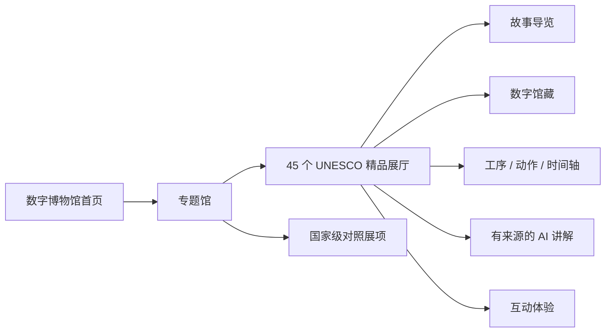
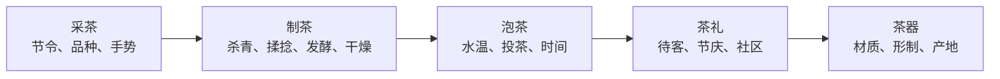
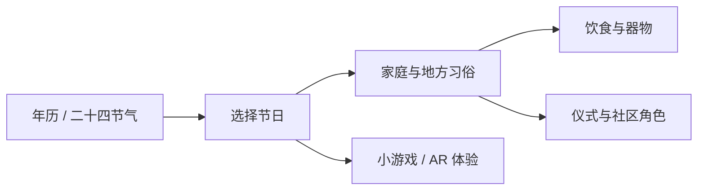
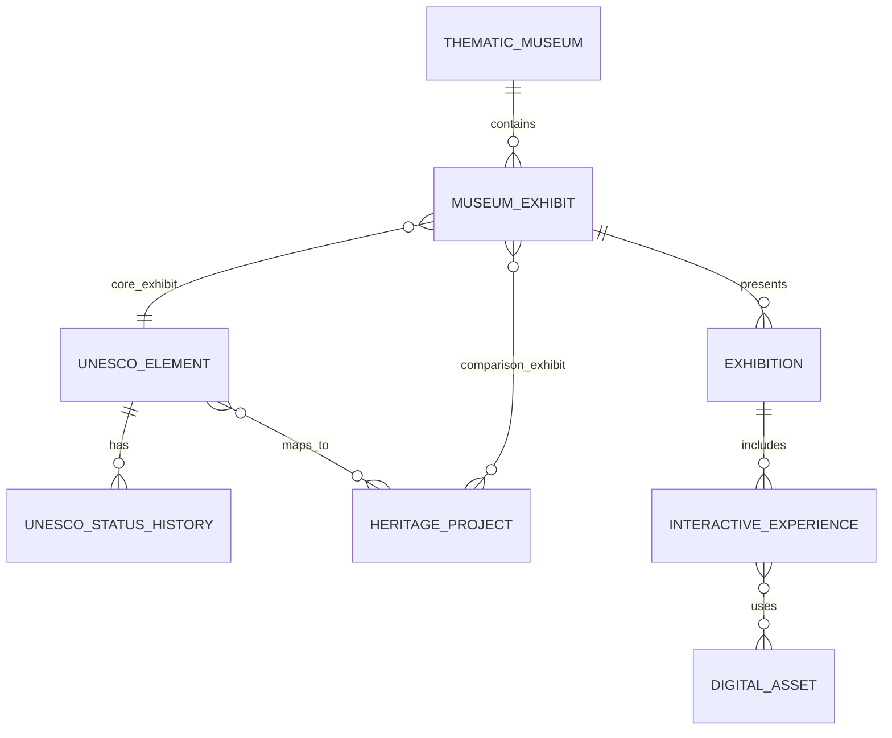

# UNESCO 中国非遗精品馆群 MVP 方案

> 版本：v1.0（2026-07-13）  
> 第一阶段范围：中国列入 UNESCO 非物质文化遗产名录、名册的 45 个项目  
> 产品组织方式：专题馆 → 精品展厅 → 互动展项

> 纯前端实现、GitHub Pages 部署和版本任务见 [纯前端迭代路线](./frontend-iteration-roadmap.md)。

## 1. 产品决策

第一阶段不从全国 1557 项铺开，而是先把 45 个 UNESCO 中国项目做成 45 个精品展厅。用户看到的一级结构不是省份，也不是数据库门类，而是有明确参观主题的“专题馆”。

这不是把 45 个项目平均做成 45 篇百科文章，而是让每个项目都有一种最适合自身的“核心体验”：戏曲用声音与比较，技艺用工序与纹理，节庆用时间与仪式，武术用动作分解，口头传统用原声与叙事。

## 2. UNESCO 口径

截至 2025 年 12 月，中国共有 45 个项目列入 UNESCO 非物质文化遗产名录、名册：

- 人类非物质文化遗产代表作名录：40 项。
- 急需保护的非物质文化遗产名录：3 项。
- 优秀保护实践名册：2 项。

数据库和界面必须明确显示 `名录 / 名册类型`、`列入或入选年份`、`单独或联合申报`、`UNESCO 官方编号`，不能统一模糊标成“世界级非遗”。优秀保护实践是保护计划，不是普通遗产项目，展厅叙事应聚焦“如何保护与传承”。

### 2.1 核心展厅与对照展项

专题馆允许纳入非 UNESCO 项目进行比较，但必须分层：

| 内容角色 | 身份 | 展示方式 |
|---|---|---|
| 核心精品展厅 | UNESCO 中国名录 / 名册项目 | 独立展厅、完整导览、UNESCO 标识与来源 |
| 对照展项 | 国家级非遗或地方代表性项目 | 比较卡、知识节点、延伸参观，明确等级 |
| 文化知识节点 | 工序、器物、流派、习俗、唱段 | 依附于项目和来源，不伪装成名录项目 |

例如“戏曲馆”中的京剧、昆曲、粤剧、越剧可按各自真实身份标注；黄梅戏、川剧用于比较唱腔、妆容、乐器和地方风格，但不能因此显示 UNESCO 徽标。

## 3. 专题馆体系

一期建议设 9 个专题馆，覆盖 45 个核心展厅，并允许一个项目出现在多个专题入口。项目只建一次，专题馆是策展关系，不是数据归属。

| 专题馆 | 核心体验 | UNESCO 核心展厅示例 | 对照展项示例 |
|---|---|---|---|
| 戏曲与表演馆 | 唱腔、妆容、行当、乐器、流派比较 | 昆曲、京剧、藏戏、粤剧、越剧、皮影戏 | 黄梅戏、川剧、秦腔 |
| 茶与生活馆 | 采茶→制茶→泡茶→茶礼→茶器 | 中国传统制茶技艺及相关习俗 | 龙井、武夷岩茶、普洱茶、铁观音、白茶的地方子项 |
| 节庆与岁时馆 | 年历时间轴、习俗地图、家庭任务 | 春节、端午节、二十四节气、羌年 | 清明、中秋及相关国家级项目 |
| 手工艺馆 | 纹理放大、工序动画、360° 器物 | 中国剪纸、南京云锦、龙泉青瓷、宣纸、黎锦、木拱桥营造等 | 苏绣、湘绣、景泰蓝、紫砂 |
| 武术与身体馆 | 动作示范、重心轨迹、呼吸节奏 | 太极拳 | 少林功夫、八卦掌、咏春 |
| 音乐与声音馆 | 分轨聆听、地域声景、唱法比较 | 古琴、侗族大歌、呼麦、南音、花儿等 | 地方器乐与民歌 |
| 史诗与口头传统馆 | 人物谱、叙事地图、原声跟读 | 格萨尔、玛纳斯、赫哲族伊玛堪等 | 国家级史诗、神话与说唱传统 |
| 信俗与社区馆 | 仪式时间、空间、角色和社区记忆 | 妈祖信俗、送王船等 | 地方庙会与礼俗 |
| 文字、知识与技艺馆 | 动手排版、书写、计算、知识实验 | 中国书法、中国篆刻、雕版印刷、中国珠算、中医针灸 | 木版年画、传统医药知识节点 |

### 3.1 为什么不按行政区分类

- UNESCO 项目经常跨省、跨民族或跨国，行政区会割裂完整文化语境。
- 用户更容易从“戏曲、茶、节庆、工艺、武术”形成参观动机。
- 地图仍保留为每个专题馆的辅助视图，用于呈现地方形态，不承担一级导航。
- 法定十大门类和行政区仍保存在数据库中，供筛选、研究和合规说明使用。

## 4. 五个旗舰专题馆

### 4.1 戏曲与表演馆

#### 首页结构

1. “先听一声”：随机播放 8—12 秒经授权的代表性声音。
2. 戏曲地图：展示剧种主要流布区域，不宣称单一发源地。
3. 核心展厅：昆曲、京剧、藏戏、粤剧、越剧、皮影戏等。
4. 横向比较台：最多选择 3 个剧种。
5. 今日演出 / 数字放映：运营内容，与名录事实分层。

#### 比较维度

| 维度 | 交互 |
|---|---|
| 妆容 | 同屏放大、热点标注、颜色和图案解释 |
| 唱腔 | 同一情绪或场景的短音频 A/B，对照文字谱和字幕 |
| 乐器 | 点击舞台位置独奏 / 合奏，查看音色和作用 |
| 行当 / 角色 | 角色卡、服装、动作和声腔关联 |
| 流派 | 时间线 + 师承关系图；争议关系附来源 |
| 舞台 | 一桌二椅、实景舞台、面具 / 道具的空间比较 |

#### AI 播放唱段的边界

- 优先播放已授权的真人录音，标注表演者、剧目、录制时间与权利信息。
- AI 可做唱段检索、逐句讲解、唱词字幕、伴奏分轨和音色比较。
- 如果使用合成演示，必须标注“AI 合成示范”，不得冒充具体艺术家或传承人。
- 不克隆在世演员声音，除非取得明确、可撤回、覆盖具体用途的授权。
- 完整剧目和商业录音不默认提供，按授权范围播放片段。

### 4.2 茶与生活馆

“中国传统制茶技艺及相关习俗”是一个 UNESCO 核心展厅；龙井、武夷岩茶、普洱茶、铁观音、白茶等是展厅内的地方实践和比较路径，不拆成五个 UNESCO 项目。

核心交互：

- 拖动鲜叶进入不同工序，观察颜色、形态和香气描述变化。
- 横向比较绿茶、乌龙茶、黑茶、白茶等工艺路径；不做“唯一标准泡法”结论。
- 通过地图查看地方实践、保护单位与代表性传承人。
- “泡一杯茶”计时互动：水温、投茶量、冲泡时间使用范围表达并说明来源。
- 茶礼通过家庭、节庆、社区和待客场景呈现，不只展示商品。
- 茶器支持 360° 查看和器形热点说明。

### 4.3 节庆与岁时馆

一期核心展厅优先：春节、端午节、二十四节气、羌年。清明、中秋作为延伸主题进入时间轴，但按各自真实名录身份标注。

交互建议：

- 时间轴可在公历、农历、节气三个尺度切换。
- 点击节日查看全国共性和地方差异，避免用一种习俗代表全国。
- 端午龙舟 AR：桌面模式观看结构，场地模式查看比例；无 AR 时降级为 3D。
- 春节任务：贴年红、备年饭、拜年礼序等可组合家庭任务。
- 节气观察：结合用户所在城市的气候提示，但明确节气知识与实时天气不同。
- 小游戏不对祭祀、信俗做娱乐化评分；更适合使用观察、排序、匹配和共同完成。

### 4.4 手工艺馆

优先核心展厅：中国剪纸、南京云锦织造技艺、中国蚕桑丝织技艺、黎族传统纺染织绣技艺、龙泉青瓷、宣纸、中国传统木结构营造技艺、木拱桥传统营造技艺等。

#### 通用交互组件

- 作品转台：360° 旋转、惯性控制、热点说明、比例尺。
- 超级放大镜：从整件作品缩放到纤维、经纬、刀痕、釉面和纸纹。
- 工序动画：原料 → 工具 → 动作 → 半成品 → 成品，每步有真人影像入口。
- 材料实验：替换材料后解释为何结构、色泽或耐久性变化。
- 匠人视角：第一人称音频或字幕，不让 AI 代替社区和传承人的声音。
- AI 讲解：基于已审核工序知识回答“为什么”，每段答案附来源。

#### 与苏绣、湘绣、景泰蓝、紫砂的关系

它们可以作为国家级对照展项进入“纹样”“针法”“金属与釉色”“泥与火”等比较主题，但不改变 UNESCO 核心展厅数量，也不显示 UNESCO 身份。

### 4.5 武术与身体馆

一期以太极拳为 UNESCO 核心展厅；少林功夫、八卦掌、咏春作为国家级或相关传统武术对照展项。

核心体验：

- 双视角动作示范：正面 / 侧面切换，支持 0.25×—1× 慢放。
- 动作骨架叠加：展示重心、手脚轨迹和方向，不用于给用户做医疗或专业训练诊断。
- 招式拆解：起势、转移、完成、回收四段，不把流派差异合并成唯一标准。
- 呼吸提示：只作文化和基础练习说明；身体不适者停止体验。
- “跟练镜像”默认只在本地处理摄像头画面；不上传原始视频。
- 比较维度：步法、发力观念、训练方式、器械、地域与师承。

## 5. 精品展厅统一模板

每个展厅共用骨架，但必须有自己的“招牌互动”。

| 展厅段落 | 内容 | 最低交付标准 |
|---|---|---|
| 入口 | 15 秒氛围、名称、UNESCO 类型 / 年份 | 1 张主视觉 + 1 段可跳过声音 |
| 三分钟认识 | 故事化音频、同步字幕、全文稿 | 1 条 3—5 分钟导览 |
| 一眼看懂 | 核心知识图 / 时间轴 / 地图 | 1 个结构化可视化 |
| 招牌互动 | 项目最适合的互动体验 | 1 个可完整操作的核心互动 |
| 人与社区 | 传承人、实践群体、地方形态 | 至少 2 个有来源的人 / 社区视角 |
| 数字馆藏 | 图片、录音、视频、3D / 全景 | 至少 8 件合规资产 |
| 比较与关联 | 同馆项目横向比较 | 至少 3 个可解释关系 |
| 保护进行时 | 名录变化、保护实践、风险与行动 | 1 个保护叙事模块 |
| 来源 | UNESCO、官方名录、采访和版权 | 关键事实字段级来源 100% |
| 带走 | 收藏、分享、学习卡、下一展厅 | 1 个明确下一步 |

### 5.1 五类招牌互动模板

| 项目类型 | 招牌互动 |
|---|---|
| 表演 / 音乐 | 分轨聆听、角色 / 乐器热点、唱腔比较 |
| 手工艺 / 营造 | 工序图、纹理放大、3D 拆解、材料实验 |
| 节庆 / 信俗 | 时间轴、角色关系、地方习俗地图、AR |
| 武术 / 身体实践 | 慢放、多视角、动作路径、镜像跟练 |
| 口头传统 / 知识 | 原声、逐句转写、叙事地图、人物谱 |

## 6. 首页与导航

底部一级导航建议改为：

1. `首页`：今天逛什么、继续参观、节令内容。
2. `专题馆`：九个馆的主入口。
3. `发现`：45 个 UNESCO 项目完整清单、地图、时间线、关系探索。
4. `互动`：小游戏、AR、3D、学习任务。
5. `我的`：收藏、足迹、离线内容、设置。

首页不要一次摆出 45 张同权卡片，推荐结构：

- 首屏：“今天，走进一个世界级非遗展厅”。
- 第二屏：戏曲、茶、节庆、手工艺、武术五个旗舰馆。
- 第三屏：按声音、动作、手作、节令等“体验方式”进入。
- 第四屏：UNESCO 45 项完整清单入口与 40 / 3 / 2 统计解释。
- 第五屏：正在保护、最近新增和优秀保护实践。

## 7. 数据模型调整

在全国名录数据库基础上新增策展层，不复制项目事实：

### 7.1 `unesco_element`

| 字段 | 说明 |
|---|---|
| `unesco_reference_no` | UNESCO 项目编号，唯一 |
| `name_zh` / `name_en` | 中英文官方名称 |
| `list_type` | `REPRESENTATIVE/URGENT_SAFEGUARDING/GOOD_PRACTICE` |
| `inscription_year` | 当前列入 / 入选年份 |
| `nomination_mode` | `CHINA/JOINT` |
| `states_parties` | 申报国家列表，结构化关联 |
| `unesco_url` | UNESCO 官方页面 |
| `nomination_file_asset_id` | 申报文件快照 |
| `status` | `ACTIVE/TRANSFERRED/REMOVED` |
| `summary` | 已审核公众摘要 |

### 7.2 `unesco_status_history`

用于处理“从急需保护名录转入代表作名录”等变化：`element_id`、`from_list_type`、`to_list_type`、`decision_no`、`decision_date`、`effective_year`、`source_record_id`。界面展示完整历史，不能只覆盖当前类型。

### 7.3 `unesco_element_project_map`

一个 UNESCO 项目可能映射多个国家级项目 / 子项，一个国家级项目也可能参与联合 UNESCO 项目。字段：`unesco_element_id`、`heritage_project_id`、`project_item_id null`、`mapping_role`、`mapping_basis`、`verified_by`。

### 7.4 `thematic_museum`

字段：`slug`、`name`、`tagline`、`curatorial_statement`、`cover_asset_id`、`sort_order`、`publication_status`。

### 7.5 `museum_exhibit`

字段：`museum_id`、`entity_type`、`entity_id`、`exhibit_role`（`UNESCO_CORE/NATIONAL_COMPARISON/KNOWLEDGE_NODE`）、`curatorial_angle`、`sort_order`、`featured`。同一项目可进入多个专题馆。

### 7.6 `interactive_experience`

字段：`experience_type`（比较台、时间轴、工序、3D、AR、声音、动作等）、`config_schema_version`、`config jsonb`、`fallback_mode`、`accessibility_mode`、`device_capabilities`、`asset_rights_status`。

## 8. API 调整

| 方法 | 路径 | 用途 |
|---|---|---|
| `GET` | `/api/v1/unesco/elements` | 45 项清单，按类型、年份、联合申报筛选 |
| `GET` | `/api/v1/unesco/elements/{id}` | UNESCO 身份、历史、国内项目映射 |
| `GET` | `/api/v1/museums` | 专题馆列表 |
| `GET` | `/api/v1/museums/{slug}` | 专题馆首页与展厅卡片 |
| `GET` | `/api/v1/museums/{slug}/compare` | 可比较项目和维度定义 |
| `POST` | `/api/v1/comparisons` | 生成 2—3 个项目的结构化比较 |
| `GET` | `/api/v1/exhibitions/{slug}` | 精品展厅内容块 |
| `GET` | `/api/v1/experiences/{id}` | 互动配置、资源与降级方案 |
| `POST` | `/api/v1/ai/guide` | 基于已发布来源的展厅问答 |
| `GET` | `/api/v1/media/{id}/manifest` | 分轨、字幕、转码与授权后的播放清单 |

比较接口不能让客户端自由拼接不兼容字段。服务端返回策展人定义的维度、缺失值说明和来源。

## 9. AI 能力设计

### 9.1 可以做

- 展厅问答：只检索已发布、可授权使用的知识库。
- 多层讲解：儿童版、三分钟版、深度版、长辈慢速版。
- 唱词 / 方言 / 民族语言的对齐、字幕和已审核翻译。
- 根据馆藏定位到具体工序、人物、乐器或时间点。
- 生成个性化参观路线，并解释选择原因。
- 对用户拍摄的纹样或器物做相似馆藏检索，不直接做真伪鉴定。

### 9.2 不应直接做

- 未经授权模仿具体传承人、演员或歌者的声音和形象。
- 把 AI 合成唱段与历史录音混在一起展示。
- 对传统医药提供诊断、处方或疗效承诺。
- 对武术动作提供伤病诊断或替代专业指导。
- 把争议起源、民族归属、流派关系回答成单一确定事实。

每次 AI 回答返回 `citations`、`content_version`、`generated_at` 和“不确定 / 多观点”状态；关键文化事实无来源时拒答。

## 10. 跨端实现优先级

### H5

- 承担搜索传播、分享落地、轻量展厅和 SEO。
- 3D / AR 自动检测能力，无法运行时展示视频或可旋转序列图。
- 不要求登录即可参观。

### 微信小程序

- 承担微信分享、扫码进馆、亲子任务和线下场馆联动。
- 资源按专题馆分包；大体积 3D 与音视频走 CDN，不进入代码包。
- 订阅消息只用于用户主动订阅的展览更新或任务提醒。

### App

- 承担离线精品馆、后台音频、多视角动作、原生 AR 和较完整的无障碍能力。
- 相机动作分析默认端侧完成，不保存原始视频。
- 下载包按展厅管理，清楚显示大小、版权期限与过期策略。

## 11. 内容生产规格

一个“精品展厅”建议最低内容包：

- 1 套主视觉与 3 个跨端裁切版本。
- 1 条 3—5 分钟主导览，含字幕、全文稿、章节与慢速版。
- 8—20 件已授权数字馆藏。
- 1 个招牌互动、1 个轻量小游戏、1 个无障碍降级版本。
- 1 个项目结构图或时间轴。
- 3—8 位人物 / 社区 / 机构节点。
- 5—15 条已审核知识关系。
- UNESCO 官方来源、国内名录映射、版权与授权记录。
- 1 个“保护进行时”模块。

按此标准，45 个展厅不是轻量内容工程。建议先制作 5 个标杆展厅验证模板，再批量化。

## 12. MVP 制作顺序

### Wave 1：五个标杆展厅（8—10 周）

1. 京剧：验证音频、唱词、角色、乐器和全景。
2. 中国传统制茶技艺及相关习俗：验证跨地区子项和工序流程。
3. 太极拳：验证多视角动作、慢放和端侧摄像头能力。
4. 中国剪纸：验证纹理放大、工序动画和轻互动。
5. 春节：验证年历、地方习俗地图、亲子任务和节令运营。

这五个展厅分别代表表演、生活技艺、身体实践、手工艺和节庆五类模板。

### Wave 2：五个旗舰专题馆（10—14 周）

- 戏曲与表演馆
- 茶与生活馆
- 节庆与岁时馆
- 手工艺馆
- 武术与身体馆

加入横向比较、专题馆首页和国家级对照展项，但 UNESCO 身份严格分层。

### Wave 3：覆盖 45 个核心展厅（分批持续）

- 先为全部 45 项上线“基础精品版”：身份、三分钟导览、核心可视化、来源。
- 再按访问需求、素材授权和互动价值升级“沉浸版”。
- 急需保护项目与优秀保护实践优先制作“保护进行时”，避免只追求视觉热门项目。

## 13. MVP 验收指标

### 内容与数据

- 45 个项目 UNESCO 身份、类型、年份和官方来源准确率 100%。
- UNESCO 项目与国家级项目 / 子项映射人工审核率 100%。
- 核心事实来源覆盖率、公开资产权利记录覆盖率 100%。
- 核心展厅与对照展项在所有入口均有清晰身份标识。

### 用户体验

- 新用户 2 次点击内进入任一专题馆，3 次点击内开始核心体验。
- 80% 测试用户能说清“专题馆、UNESCO 核心展厅、国家级对照展项”的区别。
- 五个标杆展厅核心互动完成率不低于 60%。
- 音频字幕、文字稿、键盘 / 读屏、200% 字号和无 AR 降级全部通过。
- 中低端设备可在不下载 3D 资源的情况下完成整个展厅。

### AI 与伦理

- AI 讲解引用覆盖率 100%，无来源关键事实拒答率 100%。
- 真人录音、AI 合成音和演示音效有视觉与听觉双重标识。
- 用户相机原始画面默认不上云、不留存。
- 传统医药、宗教信俗、民族归属和在世人物声音通过专项审核。

## 14. 当前原型改造路径

当前原型最适合作为 Wave 1 的京剧标杆展厅继续发展：

1. 首页“分类探索”改为“专题馆”，先展示五个旗舰馆。
2. 当前京剧专题保留，补充 UNESCO 类型、列入年份、官方来源和权利信息。
3. `projects` 硬编码数据改成 `unesco_element + exhibition` API。
4. 分类页改为专题馆页；地图降为“发现”下的辅助入口。
5. 京剧的角色、脸谱、唱做念打、舞台和剧目模块迁移为通用内容块。
6. 全景保留为京剧招牌互动；音频改用带字幕、章节和授权信息的播放清单。
7. 下一批复用同一内容协议制作制茶、太极拳、剪纸和春节展厅。

## 15. 官方依据

- [UNESCO：中国非物质文化遗产名录与名册页面](https://ich.unesco.org/en/state/china-CN)：截至 2025 年显示 45 个列入项目，并提供各项目类型、年份和官方页面。
- [中国非物质文化遗产网：联合国教科文组织非物质文化遗产名录、名册](https://www.ihchina.cn/directory_list)：截至 2025 年 12 月为 40 项代表作、3 项急需保护、2 项优秀保护实践。
- [UNESCO：春节列入代表作名录的委员会决定](https://ich.unesco.org/en/Decisions/19.COM/7.b.29)：春节项目的列入决定与申报信息。
