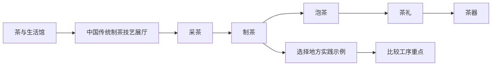

# v0.5：茶文化馆与通用工序流程

> 状态：已实现并通过本地质量门禁。  
> 范围：纯前端 H5；内容随仓库版本化并由 Zod 校验；不接入实时 AI 或服务端。

## 1. 目标与边界

v0.5 交付“茶与生活馆”的首个完整精品展厅，用一条可操作的流程解释中国传统制茶技艺及其相关社会实践，同时沉淀可被手工艺、节庆准备等主题复用的流程组件。

本版本的 UNESCO 核心项目是 **中国传统制茶技艺及其相关习俗**（2022 年列入人类非物质文化遗产代表作名录）。页面必须明确区分该总项目与龙井、武夷岩茶、普洱茶、铁观音、白茶等地方实践示例；后者不能显示为独立 UNESCO 项目。

不在本版本内：商业导购、健康功效判断、实时 AI 问答、真实地理定位、未经授权的实拍媒体、360° 器物影像。器物浏览以可访问的图文卡片降级，待取得授权素材后再接入转台。

## 2. 用户主路径



1. 用户从专题馆的“UNESCO 核心展厅”进入中国传统制茶技艺。
2. 在展厅内通过五步流程逐段认识“采茶 → 制茶 → 泡茶 → 茶礼 → 茶器”。
3. 每一步显示简短说明、对应的知识要点和可切换的地方实践示例。
4. 用户可点击任一示例查看其茶类、产地和“制茶”阶段的关键工序；该比较是教育性摘要，不作为品质或冲泡建议。

## 3. 信息架构与交互

### 3.1 展厅结构

| 区块 | 内容 | 交互与无障碍 |
| --- | --- | --- |
| 首屏 | UNESCO 身份、年份、主题、收藏 | 图片有替代文本；收藏具备 `aria-pressed` |
| 导览目录 | 初识、流程、地方实践、来源 | Hash 查询参数定位，刷新与分享不丢失位置 |
| 初识 | 茶从生产到分享的整体语境 | 只陈述有来源支持的事实 |
| 工序流程 | 五个步骤及步骤详情 | 原生 `button`；当前步骤用文字、编号和颜色共同表达；键盘可操作 |
| 地方实践 | 5 个示例的横向选择与对比摘要 | `tablist` / `tab` / `tabpanel` 语义，左右方向键切换 |
| 来源说明 | UNESCO、更新日期、内容与权利说明 | 外链新窗口打开且标记来源 |

### 3.2 通用流程组件

`ProcessFlow` 是无状态展示组件，输入一个流程对象和可选默认步骤；页面只负责读写 URL 中的 `step` 参数。

```ts
type ProcessStep = {
  id: string;
  order: number;
  title: string;
  summary: string;
  detail: string;
  keywords: string[];
};

type ProcessFlowData = {
  id: string;
  title: string;
  accessibilityLabel: string;
  steps: ProcessStep[];
};
```

组件不依赖茶类字段、图片格式或地图数据，因此下一阶段可以将剪纸的“画样 → 折叠 → 剪刻 → 展开”直接接入。动画仅作为 CSS 增强；`prefers-reduced-motion` 下禁用过渡，文字详情始终存在。

### 3.3 内容 Schema

新增 `teaExhibitionSchema`，由以下字段构成：

- `id`、`name`、`year`、`listType`、`updatedAt`；
- `summary`、`description`、`cover`、`rights`；
- `sources`：至少一个带标题与 URL 的官方来源；
- `process`：至少两个、顺序连续且 ID 唯一的流程步骤；
- `regionalPractices`：地方示例，含 `name`、`teaCategory`、`place`、`processFocus`、`disclosure`。

约束：流程 ID 不重复；`order` 从 1 连续递增；地方示例只可引用已有流程 ID。Schema 校验失败即阻止构建和测试继续。

## 4. 内容口径与来源

核心事实以 UNESCO 的项目页面为准：该项目覆盖茶园管理、采茶、手工制茶、饮茶与分享，并说明绿、黄、黑、白、乌龙、红六大茶类及再加工茶的存在。地方实践示例是面向公众的过程观察入口；不宣称特定产区、品牌或产品具有 UNESCO 独立名录身份。

| 信息 | 来源 | 用途 |
| --- | --- | --- |
| 名录身份、年份、项目范围 | [UNESCO 项目页](https://ich.unesco.org/en/RL/traditional-tea-processing-techniques-and-associated-social-practices-in-china-01884) | 首屏、来源卡、基础叙述 |
| 采摘、萎凋、杀青、做青、揉捻等示例画面与说明 | [UNESCO 官方图片说明](https://ich.unesco.org/en/7b-representative-list-01281?call=slideshow&id=01884&include=slideshow_inc.php&mode=scroll) | 工序用词核对；不直接复用图片 |
| 中国 UNESCO 项目清单 | [中国非物质文化遗产网](https://www.ihchina.cn/chinadirectory.html) | 名录对照 |

所有本版本插画为“概念插画”，在界面中标记为 AI 生成或待授权素材；不将其表述为历史档案或实拍记录。

## 5. 实现范围

- 新增内容文件 `content/tea-exhibition.json`、内容加载器与单元测试。
- 新增 `src/features/process/ProcessFlow.tsx` 与 `src/features/tea/TeaPracticeCompare.tsx`。
- 新增 `src/routes/TeaPage.tsx`，路由为 `#/exhibitions/traditional-tea`。
- `ExhibitionPage` 保留作普通展厅模板；茶展厅走专用精品路由。
- 更新首页/专题馆已有链接自动进入茶展厅；更新 README、路线图与版本记录。
- 先使用已有可分发封面作为图文降级；视觉素材授权完成前不新增声称真实产地的图片。

## 6. 验收与测试

1. 从茶与生活馆可进入茶展厅，且 URL 为 `#/exhibitions/traditional-tea`。
2. 五步流程可鼠标、触控、键盘切换；切换后 URL 的 `step` 与面板内容一致。
3. 地方实践 5 项均可浏览；每项明显标记为“地方实践示例，非独立 UNESCO 项目”。
4. `prefers-reduced-motion` 下不依赖动画传递信息。
5. 页面展示来源、更新时间、权利与 AI 概念插画说明。
6. Schema、单元测试、移动端 Playwright 流程和完整质量门禁全部通过。
